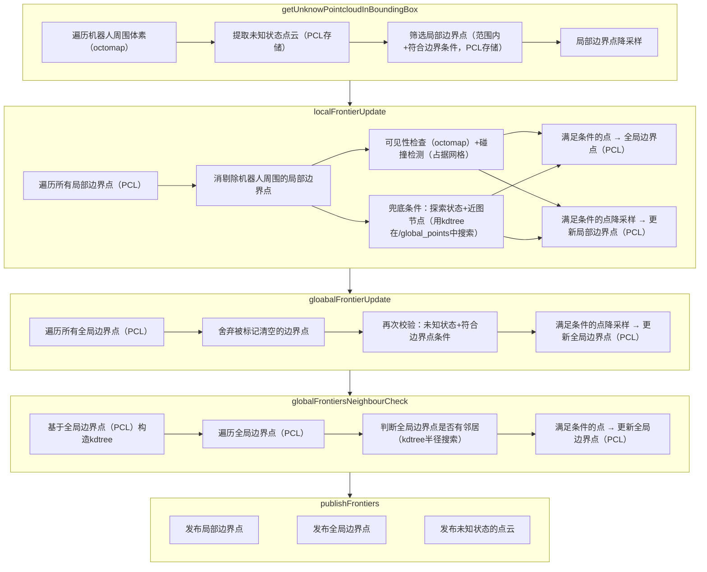
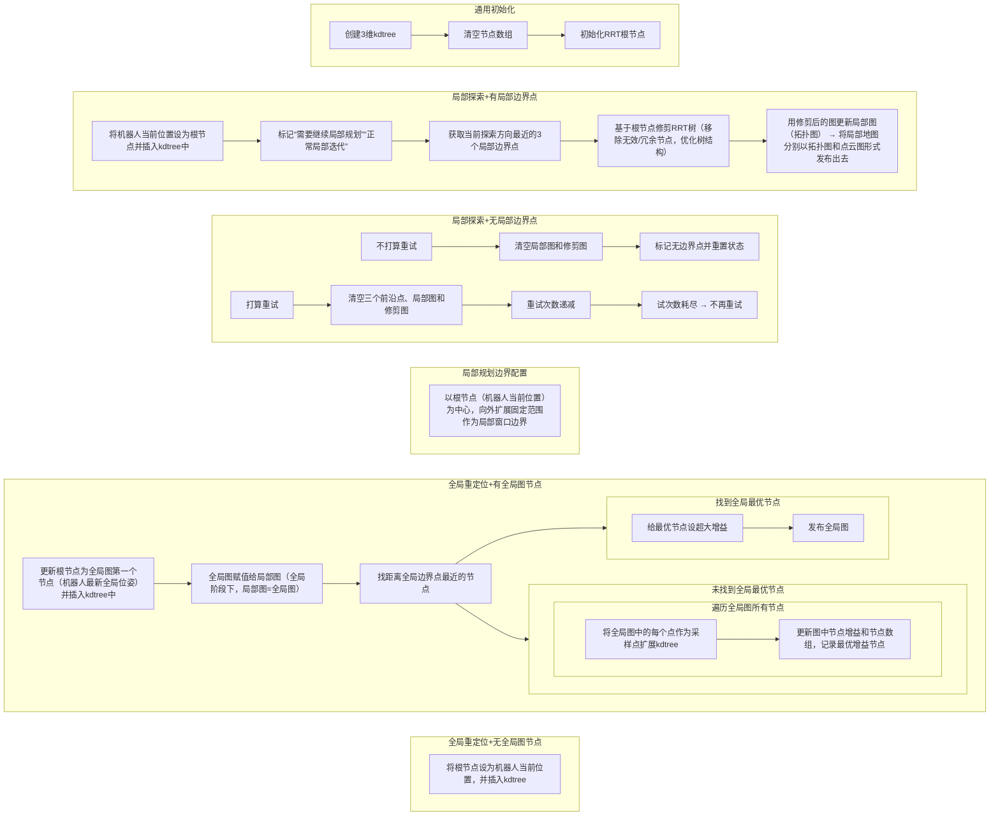

## 1. 代码依赖

- `volumetric_mapping`：[项目地址](https://github.com/ethz-asl/volumetric_mapping.git)
  - `minkindr`：[项目地址](https://github.com/ethz-asl/minkindr.git)
  - `minkindr_ros`：[项目地址](https://github.com/ethz-asl/minkindr_ros.git)

## 2. 代码结构

### 2.1 `dsvplanner`包

#### 2.1.1 `drrtp_node`

入口文件为，此文件会启动`drrtp`

#### 2.1.2 `exploration`

订阅：

- `/state_estimation`里程计信息
- `/navigation_boundary`整个算法的边界信息

客户端：

- `/drrtPlannerSrv`发送请求规划时间点
- `/cleanFrontierSrv`

#### 2.1.3 `drrtp`

订阅：

- `/state_estimation`里程计信息
- `/navigation_boundary`整个算法的边界信息

服务端：

`/drrtPlannerSrv`返回一系列目标点以及模式（探索或返航）
`/cleanFrontierSrv`

#### 2.1.4 `dual_state_froniter`

获取备选边界点

自动执行的操作

定时器：

`getFrontiers()`维护局部和全局边界点

关键函数解析：

`getFrontiers()`

#### 2.1.5 `drrt`

关键函数解析：

`plannerInit()`

`plannerIterate()`

### 2.2 `kdtree`包

使用`kdtree`数据接口来管理`drrt`的节点，从而加速最近邻搜索

这个包使用的是[开源项目](https://github.com/jtsiomb/kdtree)

## 3. 地图结构

### 3.1 占用栅格地图`Occupancy Grid`

### 3.2 八叉地图`Octomap`

### 3.3 拓扑地图`Topological Graph`

此地图仅在`dual_state_graph`中使用，因为代码中`getGain`函数是自主探索的核心，其逻辑依赖遍历拓扑图的路径序列并累加路径上所有节点的信息增益。这是路径级的计算，需要拓扑图提供 “路径” 的概念

其中的边会分为：**关键位姿边**和**非关键位姿边**。只有机器人实际走过的路线才定为关键位姿边，可靠性极高

### 3.4 k维树`kdtree`

在`dual_state_froniter`中并不会维护一个`kdtree`，仅在需要寻找最近邻时临时构造`kdtree`

## 4. 代码讲解

### 4.1 `dual_state_frontier`

1. 根据机器人的位置，在给定搜索范围内确定局部边界点
2. 更新局部位置的边界点，并加入到全局边界点中
3. 再更新全局边界点
4. 只保留那些在指定半径范围内有邻居的全局边界点
5. 发布边界信息

此处得到的边界点皆为待选点





---

**未完待续**

参考文章

[代码解析：DSVP: Dual-Stage Viewpoint Planner for Rapid Exploration by Dynamic Expansion](https://www.guyuehome.com/detail?id=1825490290073202690)
